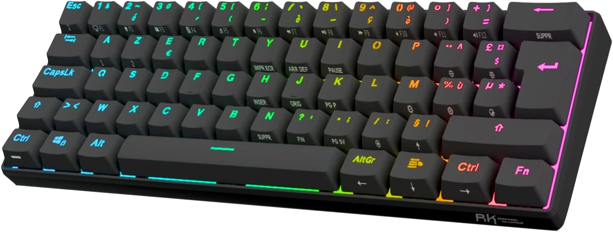

.. _apexpromini_board:

SteelSeries ApexProMini
#######################

Overview
********

The Steelseries ApexProMini is a mechanical keyboard based on 
an ARM Cortex-M4 based STM32L412RB MCU.

- STM32 microcontroller in LQFP64 package
- 62 keys
- 62 RGB LEDs
- USB-C port 

In includes the following peripherals:

- Lumissil IS31FL3743B LED driver
- FMSH FM25Q128 128Mbits serial flash memory

Hardware
********

Connections and IOs
===================

Peripheral Mapping:
-------------------

- Flash driver on SPI1: PB3/PB4/PA5/PA15
- LED controller on SPI2: PB12/PB13/PA14/PA15
- Key columns C1-C14: PA0/PA1/PA2/PA3/PA4/PA5/PA6/PA7/PC4/PC5/PC0/PC3/PC1/PC2
- Key rows R1-R5: PA11/PB10/PB2/PB1/PB0
- SWD debug port: PA13/PA14
- USB port: PA11/PA12
- Testpoints: PA8/PB6/PB8/PB9/PC10/PC11/PC12/PC13/PC14/PC15/PC8/PC9/PD2

Keyboard Mapping:
-----------------

This array corresponds to the electrical connections, not to the geometric positions.
Notice how K15 is addressed by column 12, row 5.

+----+-----+-----+-----+-----+-----+-----+-----+-----+-----+-----+-----+-----+-----+-----+
|    | C1  | C2  | C3  | C4  | C5  | C6  | C7  | C8  | C9  | C10 | C11 | C12 | C13 | C14 |
+====+=====+=====+=====+=====+=====+=====+=====+=====+=====+=====+=====+=====+=====+=====+
| R1 | K1  | K2  | K3  | K4  | K5  | K6  | K7  | K8  | K9  | K10 | K11 | K12 | K13 |     |
+----+-----+-----+-----+-----+-----+-----+-----+-----+-----+-----+-----+-----+-----+-----+
| R2 | K16 | K17 | K18 | K19 | K20 | K21 | K22 | K23 | K24 | K25 | K26 | K27 | K28 |     |
+----+-----+-----+-----+-----+-----+-----+-----+-----+-----+-----+-----+-----+-----+-----+
| R3 | K30 | K31 | K32 | K33 | K34 | K35 | K36 | K37 | K38 | K39 | K40 | K41 | K42 | K43 |
+----+-----+-----+-----+-----+-----+-----+-----+-----+-----+-----+-----+-----+-----+-----+
| R4 | K44 | K45 | K46 | K47 | K48 | K49 | K50 | K51 | K52 | K53 | K54 | K55 |     | K57 |
+----+-----+-----+-----+-----+-----+-----+-----+-----+-----+-----+-----+-----+-----+-----+
| R5 | K58 | K59 | K60 |     | K62 |     |     | K65 | K66 | K67 | K68 | K15 |     |     |
+----+-----+-----+-----+-----+-----+-----+-----+-----+-----+-----+-----+-----+-----+-----+

LED Driver Mapping:
-------------------

This is the mapping for LEDs on the Lumissil driver.

+----------+-------+-----------------------------+
| Function | Color | Area                        |
+==========+=======+=============================+
| CS1      | Blue  | K1-K11                      |
+----------+-------+-----------------------------+
| CS2      | Green | K1-K11                      |
+----------+-------+-----------------------------+
| CS3      | Red   | K1-K11                      |
+----------+-------+-----------------------------+
| CS4      | Blue  | K16-K26                     |
+----------+-------+-----------------------------+
| CS5      | Green | K16-K26                     |
+----------+-------+-----------------------------+
| CS6      | Red   | K16-K26                     |
+----------+-------+-----------------------------+
| CS7      | Blue  | K30-K40                     |
+----------+-------+-----------------------------+
| CS8      | Green | K30-K40                     |
+----------+-------+-----------------------------+
| CS9      | Red   | K30-K40                     |
+----------+-------+-----------------------------+
| CS10     | Blue  | K44-K54                     |
+----------+-------+-----------------------------+
| CS11     | Green | K44-K54                     |
+----------+-------+-----------------------------+
| CS12     | Red   | K44-K54                     |
+----------+-------+-----------------------------+
| CS13     | Blue  | K55,K56,K58-K68             |
+----------+-------+-----------------------------+
| CS14     | Green | K55,K56,K58-K68             |
+----------+-------+-----------------------------+
| CS15     | Red   | K55,K56,K58-K68             |
+----------+-------+-----------------------------+
| CS16     | Blue  | K12-K15,K27-K29,K41-K43,K57 |
+----------+-------+-----------------------------+
| CS17     | Green | K12-K15,K27-K29,K41-K43,K57 |
+----------+-------+-----------------------------+
| CS18     | Red   | K12-K15,K27-K29,K41-K43,K57 |
+----------+-------+-----------------------------+

+----------+---------------------------------------+
| Function | Column keys                           |
+==========+=======================================+
| SW1      | K1, K12, K16, K30, K43, K44, K58, K68 |
+----------+---------------------------------------+
| SW2      | K2, K13, K17, K31, K45, K59           |
+----------+---------------------------------------+
| SW3      | K3, K14, K18, K32, K46, K60           |
+----------+---------------------------------------+
| SW4      | K4, K15, K19, K33, K47, K62           |
+----------+---------------------------------------+
| SW5      | K5, K20, K27, K34, K48                |
+----------+---------------------------------------+
| SW6      | K6, K21, K28, K35, K49                |
+----------+---------------------------------------+
| SW7      | K7, K22, K29, K36, K50, K56, K65, K66 |
+----------+---------------------------------------+
| SW8      | K8, K23, K37, K41, K51                |
+----------+---------------------------------------+
| SW9      | K9, K24, K38, K42, K52, K67           |
+----------+---------------------------------------+
| SW10     | K10, K25, K29, K39, K53               |
+----------+---------------------------------------+
| SW11     | K11, K26, K40, K54, K55, K57          |
+----------+---------------------------------------+
